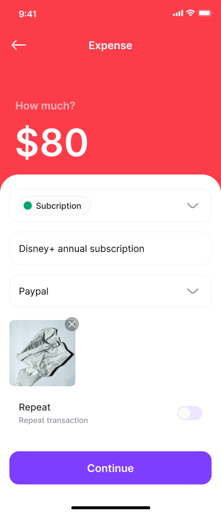

# Expense Tracker

 

## Feature
### Record Transaction
    A new transaction contains all the information for you to keep track with it. 
**Required:** Amount, Category, Wallet
**Optional:** Description, Attachments, Recursion *(schedule bills)*

### Miscellaneous
#### Authentication
- Implement with **Firebase Authentication, Google Sign In**

## Sources
- **Figma Design file**: [Montra - Expense Tracker UI Kit](https://www.figma.com/community/file/998557875473123405) By [Braja Omar Justico](https://www.figma.com/@brajaomar)